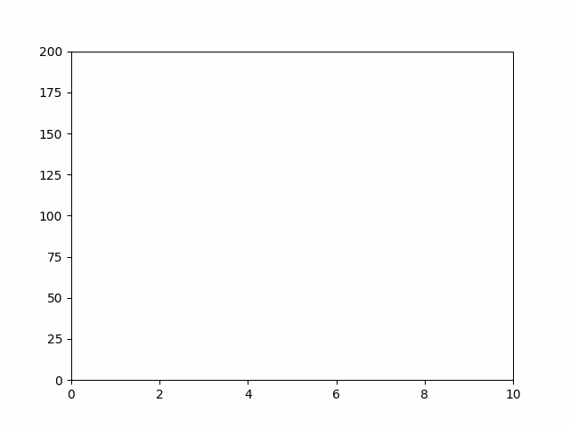

# Task Description
The task is to create a dataset of 50-60 random x, y coordinate points where x is a timestamp and y is the position in a 1D plane. The dataset should not have exact random points, but instead, it should follow a pattern with some error to prevent overfitting. Linear regression should be used to predict the next 2-3 points in the path. Finally, the whole path with time should be plotted using Matplotlib.

## Steps to Complete the Task
1. Generate a dataset of 50-60 random x, y coordinate points. The x-coordinate should be a timestamp, and the y-coordinate should be the position in a 1D plane.
2. Create a pattern for the dataset with some error to prevent overfitting. For example, if a parabolic path is used, a quadratic equation can be used to generate the dataset, but with some error added to the coordinates.
3. Use linear regression to predict the next 2-3 points in the path.
4. Plot the whole path with time(x) using Matplotlib.

*Deadline
The deadline for this task is Friday-Saturday next week, i.e., 13 October.*
 
 Prediction:  
## Status: Completed